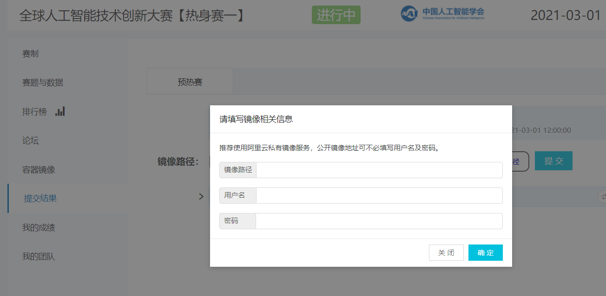

参考：
官方教程：https://tianchi.aliyun.com/competition/entrance/231759/tab/174
datawhale教程：https://github.com/datawhalechina/team-learning-cv

# 如何使用docker提交代码
## 1.安装docker
Ubuntu系统下：
```
    $ sudo apt-get update
    $ sudo apt install docker.io
```
验证是否安装成功：
`$ docker info`
## 2.开通阿里云容器服务
进入阿里云容器镜像服务 https://www.aliyun.com/product/acr?
先创建命名空间，再创建镜像仓库
创建好后完成登录操作，之后使用公网地址进行build与push操作：<br>
`sudo docker login --username=[阿里云用户名] [镜像地址]`

## 3.构建镜像并推送
可直接拉取天池构建好的镜像：<br>
`docker pull registry.cn-shanghai.aliyuncs.com/tcc-public/python:3`

#### 3.1.准备配置文件
进入项目代码所在文件夹，创建`Dockerfile`文件：<br>
`touch Dockerfile`<br>
`Dockerfile`内容如下：
```
    # Base Images
    \#\# 从天池基础镜像构建
    FROM registry.cn-shanghai.aliyuncs.com/tcc-public/python:3

    \#\# 把当前文件夹里的文件构建到镜像的根目录下
    ADD . /

    \#\# 指定默认工作目录为根目录（需要把run.sh和生成的结果文件都放在该文件夹下，提交后才能运行）
    WORKDIR /

    \#\# 镜像启动后统一执行 sh run.sh
    CMD ["sh", "run.sh"]
```
run.sh包含启动镜像后进行的操作，用于测试镜像时内容可为`python`，用于提交结果时将内容改为`python detect.py`

#### 3.2.构建镜像并推送
在服务器上直接操作:<br>
`docker build -t [镜像仓库公网地址]:[版本号] .`<br>
例如：<br>
`docker build -t registry.cn-shenzhen.aliyuncs.com/test_for_tianchi/test_for_tianchi_submit:1.0 .`

docker基本操作：<br>
查看镜像ID：`docker images`<br>
查看正在运行的容器ID:`docker ps -a`<br>
删除镜像：`docker rmi [image ID]`ID可输入3-4位简写，以下写法相同<br>
关闭容器：`docker stop [container ID]`<br>
删除容器实例：`docker rm [container ID]`<br>
启动容器：`docker run -it [image ID] /bin/bash`<br>
退出但不关闭容器：`ctrl+P+Q`<br>
进入正在运行的容器：`docker attach [container ID]`

进入容器后对环境进行配置，镜像中已经安装torch1.4，还需要安装cv2、matplotlib，scipy：
```
    pip install opencv-python
    pip install matplotlib
    pip install scipy
```

保存容器：<br>
`docker commit [container ID] [仓库地址]:[版本号]`

测试镜像：<br>
CPU镜像：`docker run [image ID] sh run.sh`<br>
GPU镜像：`nvidia-docker run [image ID] sh run.sh`

进行推送：<br>
`docker push [仓库地址]:[版本号]`<br>
例：<br>
`docker push registry.cn-shenzhen.aliyuncs.com/test_for_tianchi/test_for_tianchi_submit:1.0`

## 3.提交结果
在比赛页面点击提交结果，输入镜像地址、用户名、密码。
